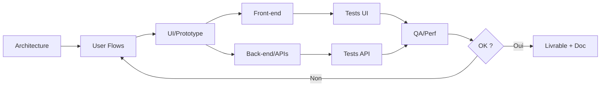

# 4) Workflow (rappel v1)
Voir/éditer Mermaid : https://mermaid.live

```mermaid
flowchart LR
  A[Architecture] --> B[User Flows]
  B --> C[UI/Prototype]
  C --> D[Front-end]
  C --> E[Back-end/APIs]
  D --> F[Tests UI]
  E --> G[Tests API]
  F --> H[QA/Perf]
  G --> H
  H --> I{OK ?}
  I -- Non --> B
  I -- Oui --> J[Livrable + Doc]
```
