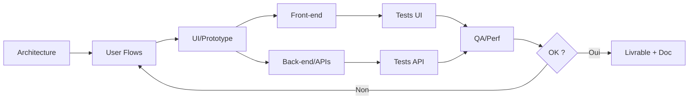

# 4) Workflow suggéré — construire des prompts “parfaits”

1. **Architecture globale** (vision + modules).
2. **User flows** + descriptions d’écrans.
3. **UI/Prototype** (états, responsive, accessibilité).
4. **Front-end** (composants petits, testables).
5. **Back-end / APIs** (validation, erreurs, tests).
6. **QA & Perf** (tests unitaires, charge, a11y).
7. **Itérations** (feedback, variantes, fusion).

## Diagramme (Mermaid)
Voir/éditer sur Mermaid Live Editor : https://mermaid.live

