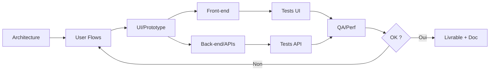

# == 00_README.md ==

# Parlios — Bibliothèque de Prompts (v1)
**Date :** 2025-10-02

Cette bibliothèque regroupe : principes, ressources, prompts-types (architecture, UI, front, back, QA), workflow d'itération, et gabarits réutilisables.
Cible : génération de sites web, UI/dashboards, prototypes, modules front/back.

## Structure
- `01_Principes_Bases.md`
- `02_Ressources.md`
- `03_Prompts_Types/` (architecture, user flows, UI, front iOS/React, back/API, revues)
- `04_Workflow_Construction.md` (inclut diagramme Mermaid)
- `05_Pieges_A_Eviter.md`
- `99_Templates/` (gabarits prompts + JSON/CSV)

> Astuce : versionnez ce dossier dans GitHub (`/prompts/`), et utilisez les fichiers `99_Templates/` comme base de vos nouveaux prompts.

# == 01_Principes_Bases.md ==

# 1) Principes de base du prompt engineering

| Principe | Pourquoi c’est important | Astuce / exemple |
|---|---|---|
| Contexte + rôle + instructions claires | Le modèle “adopte” un rôle et aligne sa sortie | « Tu es un **expert iOS + React**. Ta mission : … » |
| Spécificité (langage, framework, contraintes) | Plus la demande est précise, plus la sortie est utile | « Génère un composant **SwiftUI (iOS 17)** affichant une **liste paginée** d’articles avec images. » |
| Exemples / few-shot | Le modèle imite le format | Inclure 1–2 exemples **prompt→réponse** |
| Étapes explicites (raisonnement outillé) | Les tâches complexes gagnent en qualité | « D’abord lister les tâches → puis générer le code pour chaque tâche. » |
| Itérations / feedback | On affine la sortie | Demander **3 variantes**, comparer, fusionner |
| Scope limité | Réduit les hallucinations / erreurs | Traiter **1 module** (ex: auth) plutôt que « tout le site » |
| Validations / tests | Fiabilise le code généré | « Écris des **tests unitaires** et vérifie les erreurs possibles. » |

> Références de bonnes pratiques : Prompting Guide (promptingguide.ai), OpenAI Best Practices, etc.

# == 02_Ressources.md ==

# 2) Ressources de référence

- **Prompt Engineering Guide** — https://promptingguide.ai
- **Guide designers UX/UI** (UXPin / autres) — https://www.uxpin.com
- **50+ ChatGPT Prompts for Web Dev** (Builder.io) — https://www.builder.io/
- **Prompts pour devs** (Strapi, Pluralsight, etc.) — https://strapi.io / https://www.pluralsight.com/
- **Best practices** (Pieces, Medium) — https://pieces.app
- **Papiers UI2Code** (EfficientUICoder, ScreenCoder) — https://arxiv.org/
- **Awesome ChatGPT Prompts** — https://github.com/f/awesome-chatgpt-prompts

> Conservez ces liens dans votre wiki interne ou Notion pour accès rapide.

# == 04_Workflow_Construction.md ==

# 4) Workflow suggéré — construire des prompts “parfaits”

1. **Architecture globale** (vision + modules).
2. **User flows** + descriptions d’écrans.
3. **UI/Prototype** (états, responsive, accessibilité).
4. **Front-end** (composants petits, testables).
5. **Back-end / APIs** (validation, erreurs, tests).
6. **QA & Perf** (tests unitaires, charge, a11y).
7. **Itérations** (feedback, variantes, fusion).

## Diagramme (Mermaid)
Voir/éditer sur Mermaid Live Editor : https://mermaid.live

# == 05_Pieges_A_Eviter.md ==

# 5) Recommandations & pièges à éviter

- **Ne demande pas “tout à la fois”** : traite un module à la fois.
- **Vérifie/compile** le code généré, ne copie pas à l’aveugle.
- **Demande des tests** et des **critères d’acceptance**.
- **Pense aux états UI** (loading, vide, erreur), aux **transitions** et au **responsive**.
- **Précise le framework/lib** (SwiftUI, React, Redux Toolkit, etc.).
- **Favorise la modularité** : composants petits et réutilisables.

# == 03_Prompts_Types/3.1_Architecture.md ==

# 3.1) Architecture / Arborescence

**Prompt type :**
> Tu es un **architecte logiciel** spécialisé web + mobile. Pour un **MVP de marketplace d’artisans** (vente + chat + profil utilisateur + dashboard admin), propose une **architecture modulaire** (backend, APIs, base de données, modules front-end). Liste : modules, responsabilités, **technos recommandées**, **endpoints API** (nom, méthodes, paramètres).

**Options utiles :**
- Ajouter **contraintes non-fonctionnelles** (perf, sécurité, budget).
- Exiger **diagrammes texte** (Mermaid) + **schéma DB**.
- Demander une **checklist d’acceptance** par module.

# == 03_Prompts_Types/3.2_UserFlows_Prototype.md ==

# 3.2) User flows / Wireframes / Prototype (UI)

**Prompt type :**
> En te basant sur l’architecture, génère les **flows utilisateurs** pour : inscription, recherche produit, achat, chat, dashboard. Pour chaque écran : **description**, **éléments UI** (boutons, champs, listes), **états** (loading/erreur/vide) et **animations**.

**Bonus (génération graphique) :**
> À partir de ces descriptions, écris un **prompt pour Figma/Midjourney** afin de produire le **prototype visuel** (palette, typo, styles de boutons).

# == 03_Prompts_Types/3.3_Code_Frontend_iOS.md ==

# 3.3) Code front-end — iOS (SwiftUI)

**Prompt type :**
> Génère le **code complet SwiftUI + ViewModel** pour l’écran « Fil d’actualité » : charger une **liste paginée** d’articles, afficher **image + titre + résumé + bouton Lire plus**. Gérer **loading / erreur / vide**.

**Exigences :**
- iOS 17, **Swift Concurrency**.
- **Accessibilité** (Dynamic Type / VoiceOver basique).
- **Tests unitaires** (XCTest) pour le ViewModel.

# == 03_Prompts_Types/3.3b_Code_Frontend_React.md ==

# 3.3 bis) Code front-end — React (TypeScript)

**Prompt type :**
> Génère un **composant React** (function, TS) : **ProductCard** avec image, titre, bouton « Ajouter au panier ». **Responsive**. Indique **props** + styles (CSS modules ou styled-components).

**Améliorations demandées :**
- **Tests** (Vitest/Jest) + **accessibilité** (ARIA).
- **Perf** : `memo`, `useCallback`, `lazy` pour images.
- **Storybook** : créer une story de base.

# == 03_Prompts_Types/3.4_Backend_APIs.md ==

# 3.4) Backend / APIs

**Prompt type :**
> Génère un **service Node.js** (Express ou NestJS) pour gérer **Produits** : endpoints CRUD + **pagination** + filtres (catégorie, prix). Ajoute **validation**, **gestion d’erreurs**, **tests**. Structure **modulaire** (routes, contrôleurs, services, modèles).

**Data layer :**
> Génère les **modèles ORM** (User, Produit, Commande, ChatMessage) + **migrations** + **schémas JSON**.

# == 03_Prompts_Types/3.5_Critiques_Qualite.md ==

# 3.5) Évaluation / Critiques / Tests

**Prompt type :**
> Évalue ce **code / prototype / architecture** selon : maintenabilité, performance, sécurité, bonnes pratiques. Liste **points faibles** + **améliorations** prioritaires.

**Charge / Scalabilité :**
> Simule des **tests de charge** (N requêtes/s) sur ce module API, identifie **goulots d’étranglement** et propose **optimisations**.

# == 99_Templates/prompt_template_generique.md ==

# Gabarit — Prompt “Générique”

**Rôle & contexte**  
Tu es [RÔLE_EXPERT] spécialisé en [STACK/DOMAINE]. Ta mission : [OBJECTIF].

**Contrainte(s) & format**  
- Tech/Framework : [EX: React TS / SwiftUI iOS 17 / Node NestJS].
- Sortie : [code complet + commentaires brefs / tests unitaires / mermaid].
- Qualité : accessibilité, performances, sécurité.

**Tâches**  
1) Décris les étapes clés.  
2) Génère la sortie demandée.  
3) Ajoute les tests / validations.  
4) Propose 3 améliorations possibles.

**Acceptance**  
- [critère 1]  
- [critère 2]  
- [critère 3]

# == 99_Templates/prompt_architecture.md ==

# Gabarit — Prompt Architecture

Rôle: Architecte logiciel (web+mobile).  
Contexte: MVP [DOMAINE].  
Objectif: Proposer archi modulaire (front/back/API/DB) + endpoints.

Contraintes: sécurité, perf, budget dev.

Livrables:  
- Liste des modules + responsabilités.  
- Stack recommandée.  
- Endpoints API (nom, méthode, params, 2xx/4xx/5xx).  
- Schéma DB (texte) + Mermaid.  
- Checklist d’acceptance par module.

# == 99_Templates/prompt_ui_prototype.md ==

# Gabarit — Prompt UI/Prototype

Rôle: UX/UI designer technique.  
Objectif: Décrire les écrans et états, préparer un prompt pour outil visuel (Figma/Midjourney).

Livrables:  
- Flows pour [N] cas d’usage.  
- Liste d’éléments UI par écran (inputs, boutons, listes).  
- États (loading, vide, erreur).  
- Prompt visuel (palette, typo, styles).

# == 99_Templates/prompt_frontend.md ==

# Gabarit — Prompt Front-end

Rôle: Développeur front [React TS / SwiftUI].  
Objectif: Générer composant/page avec états, accessibilité, tests.

Contraintes: responsive, perf (memo/useCallback), a11y.

Livrables:  
- Code complet avec commentaires courts.  
- Tests (Vitest/Jest/XCTest).  
- Storybook (si React).  
- Mini-guide d’intégration.

# == 99_Templates/prompt_backend.md ==

# Gabarit — Prompt Back-end

Rôle: Développeur back [Express/NestJS].  
Objectif: CRUD + pagination + filtres + validation + erreurs + tests.

Livrables:  
- Structure modulaire (routes/ctrl/services/models).  
- Tests API.  
- Schémas JSON.  
- Guide d’erreurs (codes + messages).

# == 99_Templates/prompt_qa_review.md ==

# Gabarit — Prompt QA/Review

Rôle: Ingénieur qualité / perf / sécurité.  
Objectif: Auditer code/archi/prototype.

Sortie attendue:  
- Score par critère (maintenabilité, perf, sécurité).  
- Liste des faiblesses + quick wins.  
- Plan d’action priorisé (P1/P2/P3).  
- Test de charge simulé (paramètres + risques).
